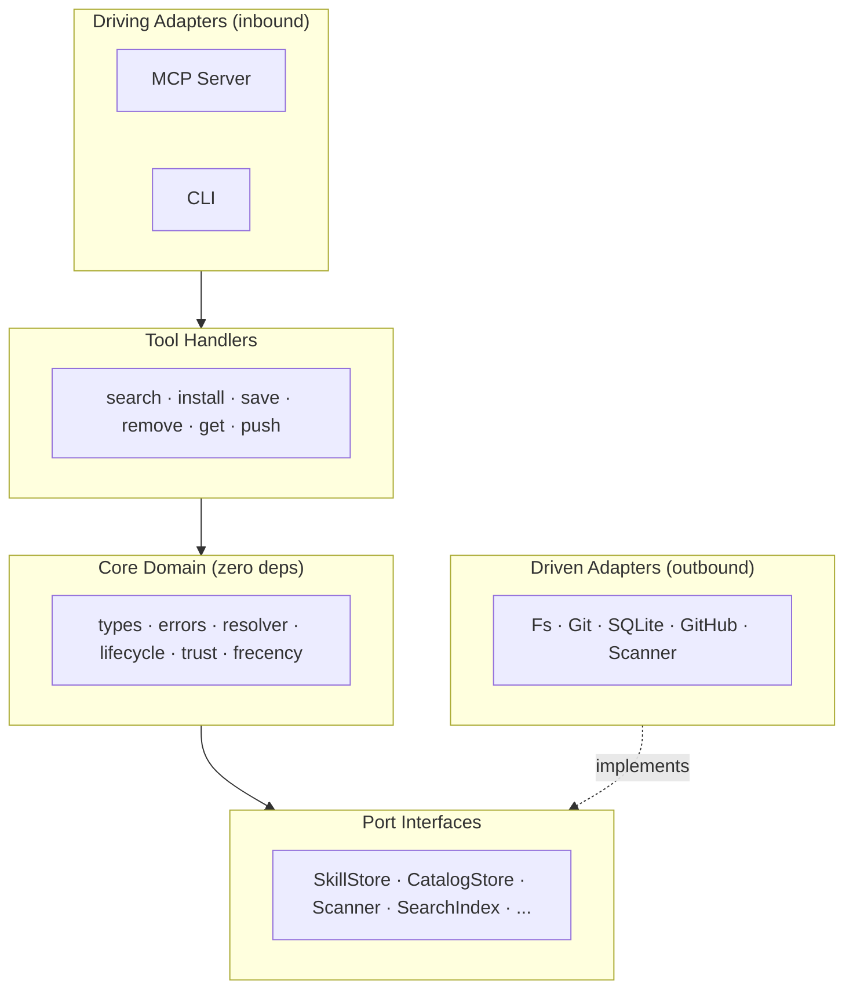
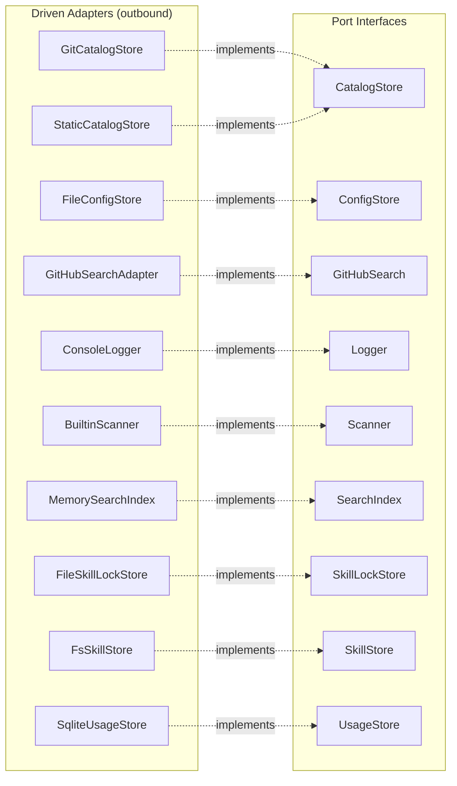

# Architecture

## Overview

Hexagonal (ports & adapters). Core domain in `src/core/` has **zero external dependencies** — only port interfaces. All I/O is in adapters.



## Source tree (from `src/`)

<!-- BEGIN:src-tree -->
```
src/
├── adapters/ (12 files)
│   ├── driven/ (10 files)
│   └── driving/ (2 files)
├── core/ (24 files)
│   └── ports/ (11 files)
├── resilience/ (5 files)
├── telemetry/ (1 files)
├── tools/ (14 files)
├── workers/ (5 files)
├── bootstrap.ts
├── cli-args.ts
├── cli.ts
├── index.ts
└── version.ts
```
<!-- END:src-tree -->

## Port interfaces (from `src/core/ports/`)

<!-- BEGIN:ports -->
| Port | Interface |
|------|-----------|
| `catalog-store` | `CatalogStore` |
| `config-store` | `ConfigStore` |
| `credential-store` | `CredentialStore` |
| `github-search` | `GitHubSearch` |
| `logger` | `Logger` |
| `scanner` | `Scanner` |
| `search-index` | `SearchIndex` |
| `skill-lock-store` | `SkillLockStore` |
| `skill-store` | `SkillStore` |
| `usage-store` | `UsageStore` |
<!-- END:ports -->

### Port → Adapter wiring (auto-generated)

<!-- BEGIN:port-adapter-diagram -->

<!-- END:port-adapter-diagram -->

Dependency direction: adapters → ports. Never the reverse.

## Key Patterns

- **ToolContext** (`src/tools/context.ts`): DI boundary. Bootstrap wires adapters → ports → context. Tool handlers receive context.
- **Config merge**: `built-in defaults → global config → project config → env overrides` (see `src/core/config-merger.ts`).
- **Resilience**: circuit breakers (remote calls), token buckets (rate limiting), tiered timeouts (local vs remote).
- **Bootstrap** (`src/bootstrap.ts`): shared wiring for both `src/index.ts` (MCP server) and `src/cli.ts` (CLI).
