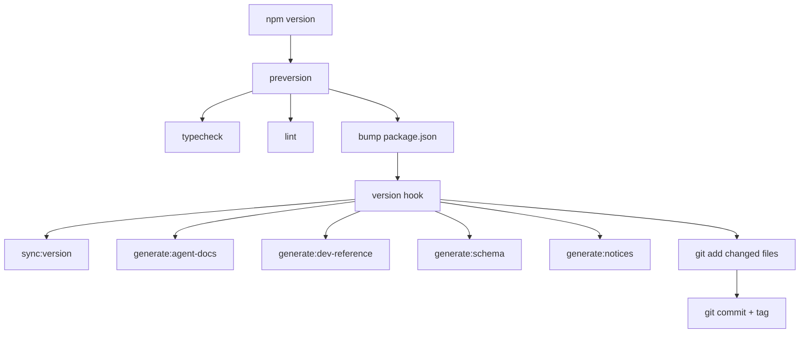

# Project Conventions

## Runtime

**Use `bun` as the default runner. Use `bunx` instead of `npx`.**

Fallback order: `bun` → `pnpm` → `npm`. CI uses `npm ci` for lockfile reproducibility.

### Pinned versions (from `mise.toml`)

<!-- BEGIN:mise-versions -->
| Tool | Version |
|------|---------|
| node | lts |
| bun | latest |
| deno | latest |
| pnpm | latest |
<!-- END:mise-versions -->

## Commands

Prefix all commands with `bun run`. Substitute `npm run` only if bun is unavailable.

<!-- BEGIN:commands -->
| Command | Runs |
|---------|------|
| `bun run build` | `tsc` |
| `bun run generate:notices` | `tsx scripts/generate-notices.ts` |
| `bun run check:notices` | `tsx scripts/generate-notices.ts --check` |
| `bun run generate:schema` | `tsx scripts/generate-schema.ts` |
| `bun run check:schema` | `tsx scripts/generate-schema.ts --check` |
| `bun run generate:dev-reference` | `tsx scripts/generate-dev-reference.ts` |
| `bun run check:dev-reference` | `tsx scripts/generate-dev-reference.ts --check` |
| `bun run sync:version` | `tsx scripts/sync-version.ts` |
| `bun run generate:agent-docs` | `tsx scripts/generate-agent-docs.ts` |
| `bun run check:agent-docs` | `tsx scripts/generate-agent-docs.ts --check` |
| `bun run check:version` | `tsx scripts/sync-version.ts --check` |
| `bun run dev` | `tsc --watch` |
| `bun run test` | `vitest run` |
| `bun run test:watch` | `vitest` |
| `bun run test:coverage` | `vitest run --coverage` |
| `bun run lint` | `oxlint && eslint src/ tests/` |
| `bun run lint:oxlint` | `oxlint` |
| `bun run lint:eslint` | `eslint src/ tests/` |
| `bun run fmt` | `oxfmt` |
| `bun run fmt:check` | `oxfmt --check` |
| `bun run check:duplication` | `jscpd src/ tests/` |
| `bun run typecheck` | `tsc --noEmit` |
<!-- END:commands -->

### mise tasks

<!-- BEGIN:mise-tasks -->
| Command | Description |
|---------|-------------|
| `mise run dev` | Install deps and start dev mode |
| `mise run check` | Run all checks (fmt, typecheck, lint) |
| `mise run ci` | Full CI pipeline locally |
<!-- END:mise-tasks -->

## Version Lifecycle

Running `npm version` triggers this automated chain:

<!-- BEGIN:version-lifecycle -->

<!-- END:version-lifecycle -->

## Git

- **Commits**: [Conventional Commits](https://www.conventionalcommits.org/) format required.
- **Pre-commit hook**: `generate:notices` → `check:duplication` → `gitleaks`. Auto-detects bun → pnpm → npm.
- **Forbidden**: `docs/internal/` must not be committed unless explicitly requested.
